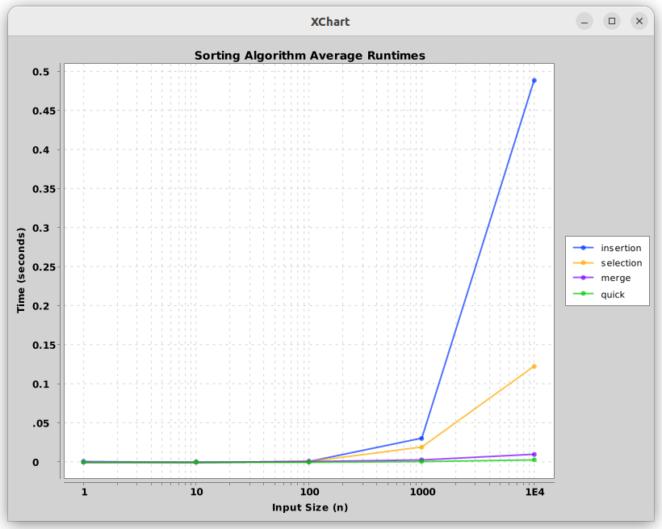

# Benchmarking Sorting Algorithms

## Summary

In this assignment, I test the runtimes of four distinct sorting algorithms to see which perform better given varying sizes of integers to sort. The algorithm list includes Insertion Sort, Selection Sort, Merge Sort, and Quicksort. I found that Merge Sort and Quicksort perform exponentially better than Insertion Sort and Selection sort as the list sizes increase logarithmically. Quicksort and Merge Sort did not substantially underperform with smaller list sizes, meaning that they are the best choice for sorting algorithm when optimizing for runtime alone, regardless of list size.

## Methodology

To benchmark the sorting algorithms, I tested each with a set of lists whose sizes increase logarithmically: (1, 10, 100, 1000, 10000). Each list contains random numbers between 1 and 999, to allow for rare element equality. I measured the runtime of each individual algorithm with each list size exactly once (though an improved method would take an average of several trials). After collecting the dataset, I plotted my results using XChart.

## Results

According to the graph, Quicksort performs the best given any input size, particularly at larger sizes. Merge Sort performs slightly worse, but is still comparable -- the difference is likely exacerbated at extremely large list sizes. Finally, Selection Sort and Merge Sort perform the worst as list sizes surpass 100, by an exponential amount.

