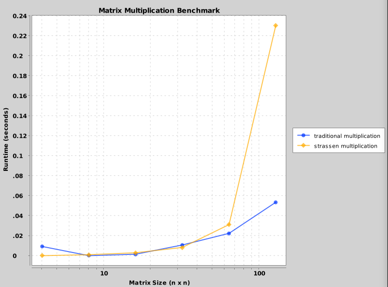
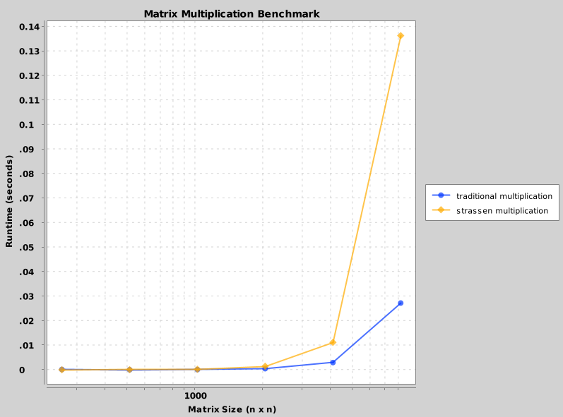

# Benchmarking Strassen's Algorithm

## Methodology

In this portion of the assignment, I compare the runtime of Strassen's Algorithm on a test set containining matrices of various sizes to performing traditional matrix multiplication on the same test set. My test set included pairs of matrices, with sizes all in powers of 2 that ranged from 4 to 8192. For each matrix pair, I found their product using both traditional matrix multiplication and Strassen's algorithm, noting the runtime of each. I then plotted the results of this experiment using XChart,

## Results

My results are split across two graphs to help with readability. The first graph shows the results of runtime benchmarking with matrix sizes between 4 and 128. The second graph shows results for matrix sizes between 256 and 8192. In both graphs, the blue line shows the runtime of traditional multiplication, while the yellow line shows the runtime of Strassen's algorithm.

I expected to see Strassen's algorithm improve with matrix size; however, I did not get these results. In my results, Strassen's algorithm was only faster than traditional matrix multiplication at very small matrix values, which was the opposite of what I expected. Strassen's algorithm performed exponentially worse at large sizes.

## Discussion

I suspect a flaw in my implementation of Strassen's algorithm under the hood. I double-checked my algorithm implementation itself, but another aspect of the code could be slowing it down, such as the number of SquareMatrix instances I am creating during its recursive loop.